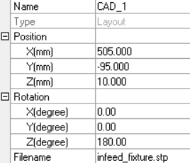
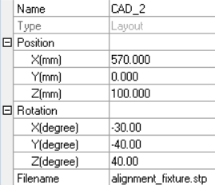
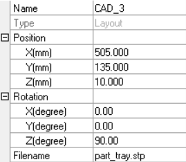
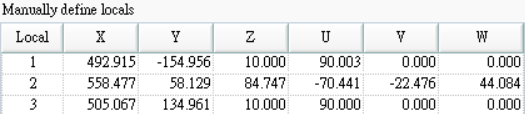
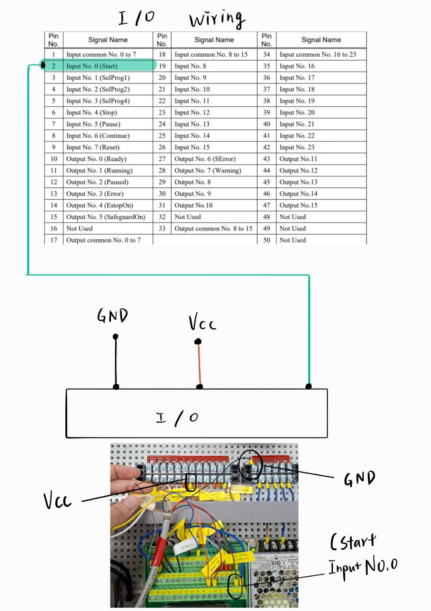
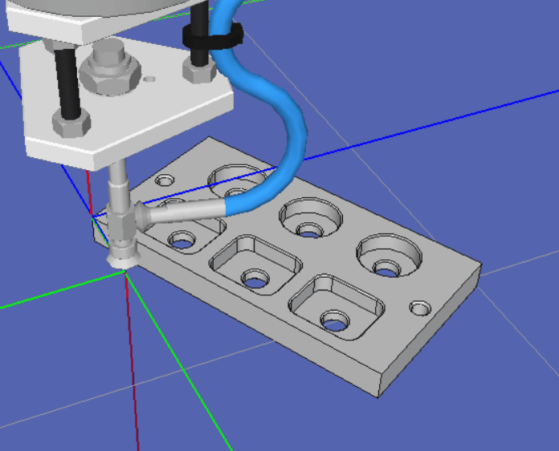
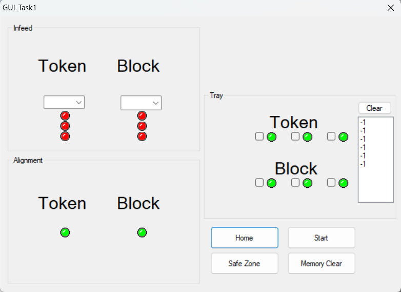
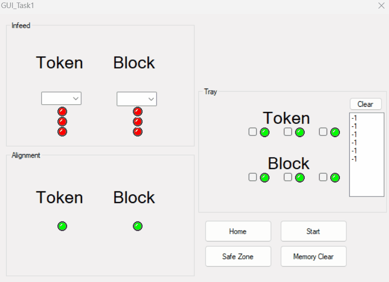
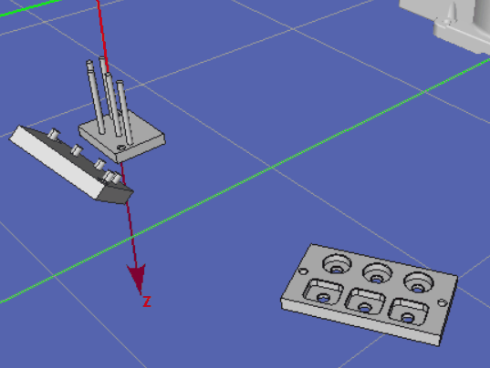
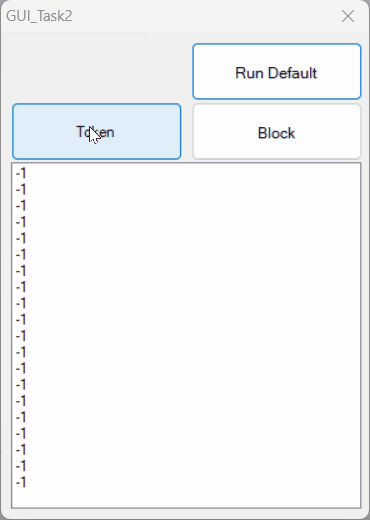

# Epson Robot

This system demonstrates two tasks, including **Pick & Place** and **Stack**, with both basic execution and GUI-based control.

## Environment
- Software: RC+7
- Robot Series: C3-A600S
- Start Mode: Auto or Program

## Pre-Setup

### 1. Task Integration
- Place the Task folder (`RobotProjectFolder/Task`) into the Epson RC+7 `project/` folder.

### 2. 3D Model Setup
- Import 3D models into the environment and set them up as shown below:

  
  
  

- Define the **local coordinate system** for each object:

  

### 3. Wiring (In the real environment)

  

### 4. Initial Calibration (In the real environment)
- Run the **CreateLocal** function and use **single-point calibration** to generate the local coordinate system.
- Run the **LocalAlignment** function to correct the positions of the objects.

📷 *Calibration process*  

  

## Task 1: Pick and Place

### Basic Workflow
The robot sequentially picks up objects and places them into the tray in order.  

### Advanced Workflow (With GUI)
Based on the selection order in the GUI, the robot places objects into the specified positions.  

Users can choose different placement sequences and quantities.  
Red and green dots are displayed on the screen, indicating **occupied** and **available** positions, respectively. 

In the Infeed section, if the selection box is empty and you press the Start button, the robot will run the Basic Workflow.

  
   
  <em>
    Red and green dots indicate occupied and available positions. 
    Only in the Tray section can you switch the status of the dots.
  </em>

#### As an example, ensure that I/O Input 0 is ON:

🎞 *GUI operation*  

  

📷 *Robot process* 

  

## Task 2: Stack

### Basic Workflow
The robot sequentially stacks tokens and blocks in an alternating pattern.

### Advanced Workflow (With GUI)
Based on the list in the GUI, the robot places objects from top to bottom according to the specified order.  
When the upper limit is reached, the workflow will execute automatically.  
If you press the "Run Default" button, the robot will perform the Basic Workflow.

🎞 *GUI operation*  

  

#### Roles
| ID | Name | Roles |
| :--- | :--- | :--- |
| M11403228 | 蔡榮德 | Programming |
| M11403203 | 黃新驊 | Mechanical |
| M11403213 | 彭珮倫 | Calibration |
| M11403212 | 張芝瑜 | Electrical Control |

---
# JetBot

## **Task 3 (AMR)**

### **Obstacle Avoidance Using Deep Learning**

This project adopts a deep learning–based approach to train an Autonomous Mobile Robot (AMR) for path following and obstacle contour recognition.
The trained model performs obstacle avoidance prediction based on visual input captured by the onboard camera.

When the obstacle detection confidence in the camera image and the trained model accuracy reach a threshold of 0.75, the system automatically triggers the obstacle avoidance decision-making process.

You can download the [Trained model](https://drive.google.com/drive/folders/1yhmVA8Zezx7skUu_QirdOwhPgkMbPpi8?usp=drive_link).

**1.** `best_steering_modev4.pth` : The trained model is mainly

**2.** `best_model_coll.pth` : In this model, the classes **“free”** and **“blocked”** are trained to identify whether there is an obstacle on the road ahead.

